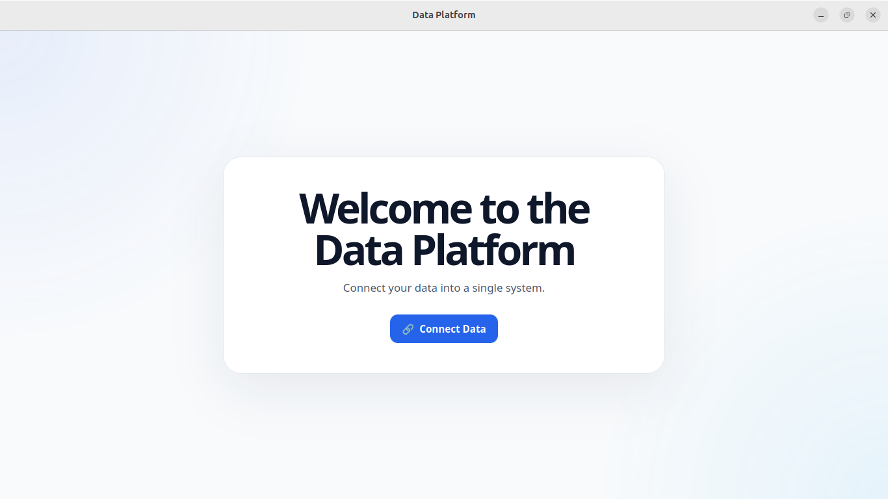
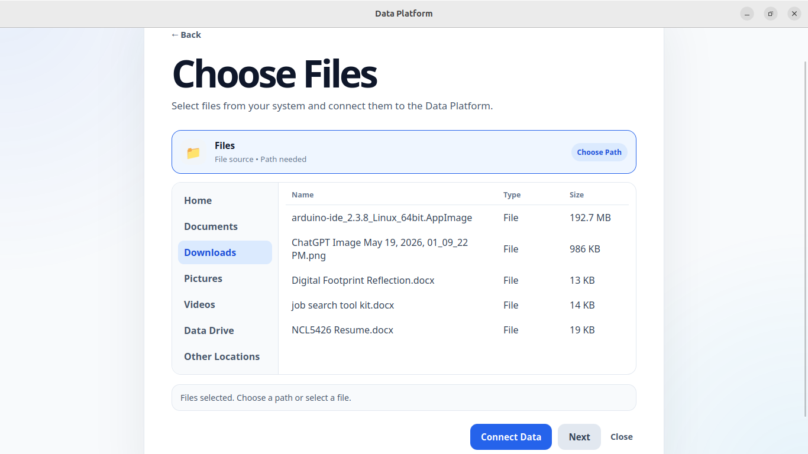
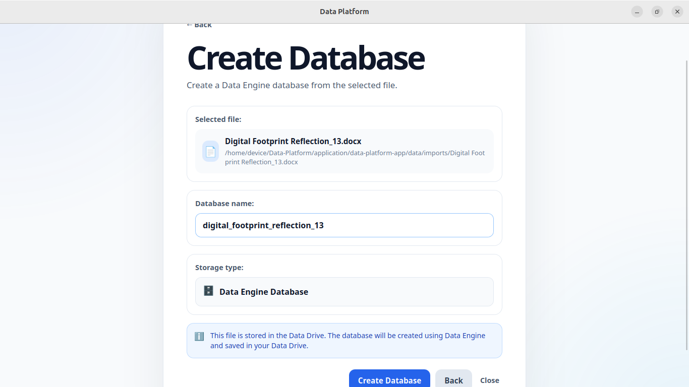
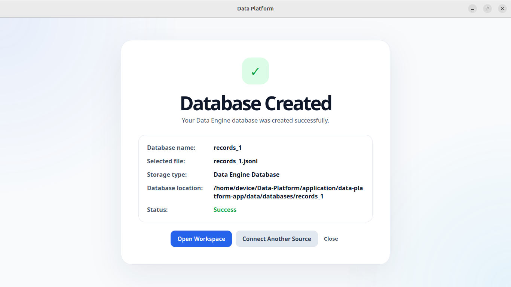
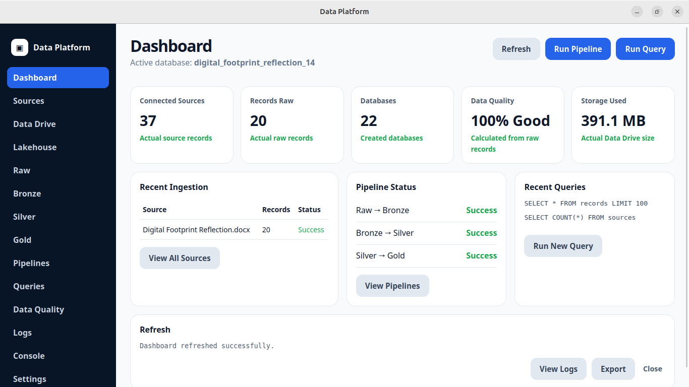

# Data Platform

Data Platform is a full-stack data platform for collecting, processing, storing, querying, and visualizing structured data from systems, devices, APIs, cloud services, and external sources.

The project combines a Python Data Engine with a desktop application built using React, TypeScript, Vite, Rust, and Tauri.

## Current Status

This project is in active development.

The current version includes a working Data Engine foundation and a working desktop user interface foundation.

## Screenshots

### Welcome Screen



### Source Selection



### Database Creation



### Database Created



### Workspace Dashboard



## What the Platform Does

Data Platform is designed to connect data sources, process incoming records, organize storage, support querying, and display results through a workspace interface.

The system is being built to support local system data, device data, file-based data, APIs, cloud sources, and future intelligent processing features.

## Core Components

Python Data Engine

React and TypeScript user interface

Tauri desktop runtime

Rust backend command layer

Local storage and lakehouse-style data organization

Validation, recovery, query, and indexing modules

## Development Direction

The platform is being built with a local-first approach and a modular architecture.

The long-term goal is to create a portable data platform that can collect real data, organize it into structured records, and make it usable through a desktop workspace.

## Run the User Interface

From the application folder:

```bash
cd application/data-platform-app
npm run build
npm run tauri dev
